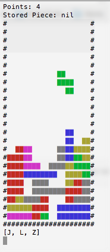

##**My Ruby Tetris**

###To Run the Game
download the file,
navigate to MyRubyTetris/lib in terminal
type: _ruby setup.rb_

**To Play the Game**
* space bar moves the piece down.
* right and left arrow lets move the piece around.
* up and down arrow keys rotate the piece.
* tab switches the current piece with a held piece.

  

